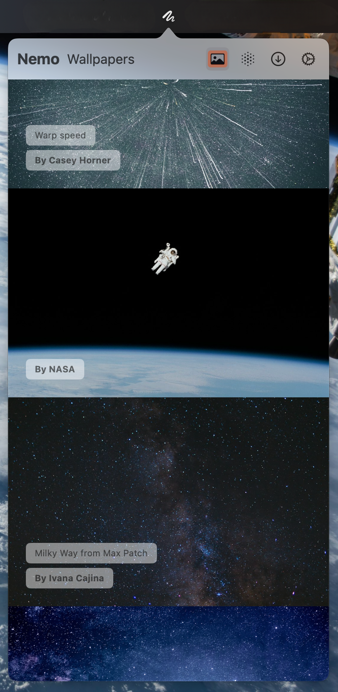
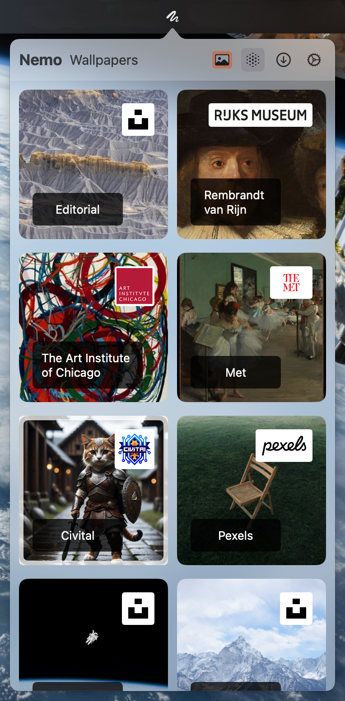

<div>
  <h3 align="center">Wallpapers</h3>
  <p align="center">
    
  </p>
  <p align="center">
    Toggle the desktop wallpaper app, integrate multiple image sources in the integration
    <br />
    <br />
    <a href="https://github.com/GaoZimeng0425/Wallpapers/releases/">Download</a>
    ·
    <a href="https://github.com/GaoZimeng0425/Wallpapers/issues/new">Report Bug</a>
    ·
    <a href="#usage">Usage</a>
    <br />
  </p>
</div>

<h3 align="center">APP screenshot</h3>
<p align="center">
  
</p>
<h3 align="center">Image Providers</h3>
<p align="center">
  
</p>


## Usage
No developer certificate, need to remove Apple authentication
```bash
$ sudo xattr -d com.apple.quarantine /Applications/Wallpapers.app
```

## Feature

- Multiple Image Sources
- Easy to change desktop wallpaper

## TODO

- [ ] Multiple desktop monitors
- [ ] More Image Sources
- [ ] Auto change wallpaper
- [ ] Keyboard shortcut

## Wallpaper Image Providers

- [Unsplash](https://unsplash.com/documentation#search-photos)
- [RIJKS Museum](https://data.rijksmuseum.nl/object-metadata/api/)
- [Art Institute of Chicago](https://www.artic.edu/open-access/public-api)
- [Civitai](https://github.com/civitai/civitai/wiki/REST-API-Reference)
- [NASA](https://api.nasa.gov/)
- [pexels](https://api.pexels.com/v1/)
- [Met](https://metmuseum.github.io/)
- [Nature History Museum](https://naturalhistorymuseum.github.io/dataportal-docs/)
- [nasjonalmuseet](https://beta.nasjonalmuseet.no/nasjonalmuseet-api/)
- [Harvardart Museums](https://github.com/harvardartmuseums/api-docs)
- [DiMu](https://github.com/nasjonalmuseet/DiMu-API-documentation)

## Acknowledgments

- [Kingfisher](https://github.com/onevcat/Kingfisher)
- [Alamofire](https://github.com/Alamofire/Alamofire)
- [UnifiedBlurHash](https://github.com/iankoex/UnifiedBlurHash)

## OS Requirement

macOS 14 minimum for SwiftUI support

## Statement

developed by interest
